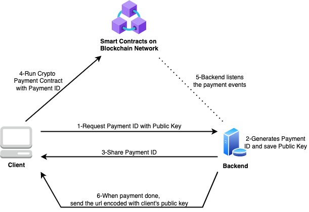

# DYOR

Processing ERC20 payments is not a simple straightforward process with one centralised solution (for now). Developers have to design and build their own "payment backend" connected to the Ronin network. Unfortunately there is no "ready-to-go" solution.

Here is a list of various articles and repositories addressing this topic. I hope this helps at least a little in inspiring your development.

Ronin is Ethereum compatible network, so anything that works on Ethereum should at 99.99% work on Ronin as well.

### Articles & Discussions


[https://ethereum.stackexchange.com/a/68866](https://ethereum.stackexchange.com/a/68866)



[https://ethereum.stackexchange.com/questions/18905/best-way-of-accepting-erc20-tokens-in-my-service](https://ethereum.stackexchange.com/questions/18905/best-way-of-accepting-erc20-tokens-in-my-service)



[https://ethereum.stackexchange.com/questions/39275/how-to-detect-eth-deposits-into-an-ether-address](https://ethereum.stackexchange.com/questions/39275/how-to-detect-eth-deposits-into-an-ether-address)



[https://ethereum.stackexchange.com/questions/28386/accept-erc20-token-payment-using-web3-js](https://ethereum.stackexchange.com/questions/28386/accept-erc20-token-payment-using-web3-js)



[https://blog.coinbase.com/usdc-payment-processing-in-coinbase-commerce-b1af1c82fb0#e539](https://blog.coinbase.com/usdc-payment-processing-in-coinbase-commerce-b1af1c82fb0#e539)



[https://medium.com/coinmonks/monitoring-an-ethereum-address-with-web3-js-970c0a3cf96d](https://medium.com/coinmonks/monitoring-an-ethereum-address-with-web3-js-970c0a3cf96d)



GitHub: [https://github.com/emmonspired/erc20-digital-signature-verify](https://github.com/emmonspired/erc20-digital-signature-verify)


### Various implementation examples

#### [**Ethereum-Blockchain-Wallet-Accounting**](https://github.com/remeshx/Ethereum-Blockchain-Wallet-Accounting)

This project generates a wallet for each user and monitors each wallet for ETH or Token deposits and withdrawals. When it receives data, it updates the wallet and sends a notification of the changes to a specified server as a listener. The project has been designed to support the ETH and USDT tokens, but it may do the same for any other token by adding it to the config file.

#### [**erc20-processor-backend**](https://github.com/deelesisuanu/erc20-processor-backend)

Backend with Nodejs to Process ERC20 Payments

#### [**ERC20\_PaymentSystem**](https://github.com/salihcemil/ERC20\_PaymentSystem)

#### 

This is a basic online payment systme based on ERC20 tokens.

In order to implement it, we used a sample ERC20 token (SMP) as the payment currency. Thanks to ERC20 standards, SMP token can simple change to any ERC20 such as USDT, USDC, DAI etc.

It can be assumed that the system has 3 different layers: blockchain layer, backend and frontend.

#### [Hub20](https://hub20.io) ([https://hub20.io/](https://hub20.io))

Hub20 is an self-hosted online payment gateway that works with any Ethereum-compatible blockchain and integrates with different Layer-2 projects for fast and cheap payments.

###

### Tx Indexing

#### [Keyko Web3 Monitoring Agent](https://github.com/keyko-io/web3-monitoring-agent)

Keyko Web3 Monitoring agent provides an intelligent software able to ingest blockchain information into Kafka. It listens for specified event emissions from the Ethereum network, and broadcasts these events into your middleware layer. It's also prepared to ingest network blocks and transactions. This provides a distinct separation of concerns and means that your microservices do not have to subscribe to events directly to an Ethereum node.

#### [TrueBlocks](https://github.com/trueblocks/trueblocks-core) ([https://trueblocks.io/](https://trueblocks.io))

TrueBlocks is a collection of libraries, tools, and applications that improve access to the Ethereum data while remaining fully local. The interface is similar to the Ethereum RPC, but offers a number of improvements:

1. TrueBlocks allows you to scrape the chain to build an index of address appearances. This index enables lightning-fast access to transactional histories for a given address (something not available from the node itself),
2. TrueBlocks also provides for a local binary cache of data extracted from the node. This speeds up subsequent queries for the same data by an order of magintude or more. This enables a much better user experience for distributed applications written directly against the node such as the [TrueBlocks Explorer](https://github.com/TrueBlocks/trueblocks-explorer),
3. TrueBlocks enhances the Ethereum RPC interfaces. For example, you may query blocks and transactions by date, by block range, by hashes or any combination. Furthermore, two additional endpoints are provided for extracting (`export`) and listing (`list`) historical transactions per address.
